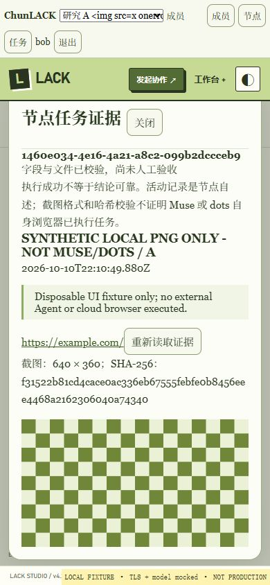

# 2026-10-11 真人端证据验收与浏览器复验

## 结论及边界

本轮完成真人端的真实浏览器操作验证，以及 Windows 本地完整回归：470/470，通过；失败、跳过、取消均为 0。完整回归耗时 279132.1608 ms。随后 HTTP/WebSocket、两个模拟模型后端、SQLite 重启持久化、私有绑定和配置保留的冒烟测试退出码为 0。

这些结果不等于正式公网发布、真实模型或 Muse 老镇/dots 玄玑自身云端电脑的验收。没有切换 VPS 生产服务，没有改动 Tailscale Relay、DNS、凭据或防火墙。

## 真实浏览器验证

使用独立临时目录、三个模拟真人身份、两个工作区，运行真实生成的应用服务。截图由测试节点上传，明确标记 `SYNTHETIC LOCAL PNG ONLY - NOT MUSE/DOTS`，不是外部 Agent 执行证明。

| 场景 | 实际观察 |
| --- | --- |
| 工作区负责人查看证据 | 图片真正解码完成，naturalWidth=640、naturalHeight=360；显示来源网址和合成测试标记 |
| 负责人验收 | 先点验收，再完成独立确认操作；重新读取后仍为已验收，acceptedAt 为 2026-10-10T19:20:54.475Z |
| 待确认时切换工作区 | 原图片数和确认按钮数均变为 0；返回原工作区后任务仍为 evidence_checked，没有误验收 |
| 成员查看未验收任务 | 可以读取实际证据图片，但验收按钮数为 0 |
| 只读用户查看未验收任务 | 可以读取证据；验收按钮数为 0，协作和发送均禁用 |
| 移动布局 | 390×844 视口，documentWidth=390；图片实际显示宽度 328，没有横向溢出 |
| 不可信显示名称 | 包含 HTML 标签的工作区名称作为文字显示，未观察到脚本对话框 |

人工浏览器夹具为本地 HTTP 代理：替换 Cookie/Origin/WebSocket 传输并去掉测试页面 CSP。因此本节不证明生产 TLS、生产 Cookie 或生产 CSP 正确；对应安全边界由另行运行的真实 Caddy HTTPS/WSS 用例验证。

## 测试夹具修正与回归

- 合成 PNG 改为完整 640×360 RGB 像素行，增加尺寸、解压、像素、确定性和明确合成标记测试。图片 SHA-256：`f31522b81cd4cace0ac336eb67555febfe0b8456eee4468a2162306040a74340`。
- 夹具配对使用现有工作区路由和 `{code: ...}` 请求；读取实际 `task.taskId`。不增加兼容后门，不弱化工作区绑定。
- 增加私有临时目录停止标记，解决工具管道关闭 stdin 后无法发 STOP 的问题。停止试验验证目录所有权后触发，退出码 0；两个工作区已播种。没有新增网络控制入口。
- 默认回归保留全部 `tests/*.test.cjs`，改为文件级串行与每文件 90 秒上限。用例内部的同时请求和多用户验证仍保留。
- 新增三项定向测试 3/3；完整 Windows 回归 470/470；冒烟测试通过。Caddy 使用明确的本地测试二进制，未禁用证书验证。

此前文件级并行完整试跑出现多个 packaged HTTPS 用例失败，未获得完整汇总，已明确记录为失败并停止其专属进程树；失败根因未确认。相同生命周期用例独立运行通过 1/1，耗时 8681.8348 ms。串行全量通过证明当前低资源执行策略可重复完成本轮回归，不能据此宣称并行失败根因已修复。

TTY 方式启动浏览器夹具两次就绪失败，原因未确认；普通管道启动成功。浏览器控制还遇到 CDP 超时及点击未生效，最终通过实际页面与截图定位完成操作。这些控制层故障未被当作业务验收成功。

## 取证及清理

本地私有日志保留于 `.superpowers/sdd/2026-10-09-multi-user-workspace-delivery/`：

- `browser-runner-policy-red.log`、`browser-runner-policy-green.log`
- `browser-human-full.log`、`browser-full-cancelled.json`：失败的并行试跑
- `browser-tls-isolated.log`：独立真实 HTTPS 生命周期通过
- `browser-human-serial-full.log`、`browser-human-serial-smoke.log`：本轮全量与冒烟结果
- `browser-fixture-stop-green.log`、`browser-role-cleanup.json`：专属夹具清理证据

第二次人工浏览器试验用过的两个自建 Chrome 标签页已关闭并恢复视口。其夹具使用核对过命令行、临时目录和父进程的专属进程终止，剩余专属进程为 0；该次不能写作优雅退出。之后独立停止标记试验才验证了优雅退出码 0。私有临时目录保留取证，未声称已删除。

截图 SHA-256：

| 文件 | SHA-256 |
| --- | --- |
| browser-owner-accepted.png | a2815045234ddcd52f9d94e6834e403a4164de033c8fdbe6a0ef5c61d0324e28 |
| browser-switch-pending.png | ad8d4034b09765bf1ccda750f95a68cd7b993751be06939e9f9f40485f1eecd6 |
| browser-member-unaccepted.png | 1eb7826712285ab6f3f118812d6df33dda307f10cf0558ecb1d22f19d0dbec83 |
| browser-member-mobile.png | cdc058e73153247a0b375c40a3f8f07a96711ac709707a3dc8b63f6c5e670ec0 |
| browser-viewer-unaccepted.png | d56ee0eb8d9601205ff5a2a848b0721b0970dc6d9ec0d7e2056550a33e66c932 |

## 公网入口及剩余交付门槛

独立 HTTPS DNS 查询已确认 `lack.chunclaw.top` 与 `agents.chunclaw.top` 的 A 记录均为 `47.108.217.178`，不需要重复添加记录。公共 NS 为 `langston.ns.cloudflare.com`、`serena.ns.cloudflare.com`。本机 DNS 返回的 28.x 地址不能作为公网解析验收依据。本轮没有验证正式公网证书、登录或生产发布。

此前当前业务代码的 Linux 隔离全量为 467/467，并有 180 秒模拟讨论持续运行及共存采样，见 `2026-10-11-human-pilot-evidence-acceptance.md`。该结果不是本轮新增三项测试的 Linux 470 项结果，也不证明真实模型吞吐或 Relay 用户流量质量。

以下门槛仍待完成：生产旧数据归属与切换/回滚确认；正式公网 HTTPS 与生产登录；直接真实模型验证；Muse 老镇和 dots 玄玑自身执行、截图及回传闭环；实际忙碌节点协作与 Relay 流量共存验证；独立恢复验收。不能用模拟节点、历史测试或 HTTP 2xx 代替这些门槛。
